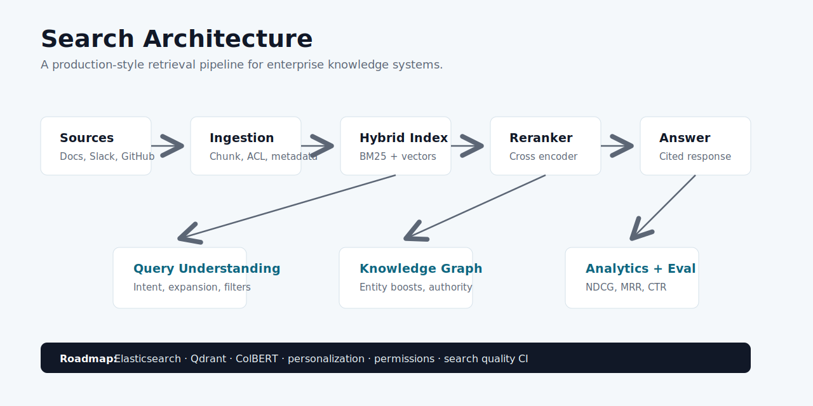

# AI Search & Enterprise Knowledge Engine

A world-class portfolio project for enterprise search, information retrieval, hybrid RAG, relevance analytics, and agentic retrieval.

[](https://divyadhole.github.io/enterprise-knowledge-engine/)
[](http://localhost:8300/docs)
[](frontend)


## Why This Project Exists

Top AI companies increasingly hire engineers who understand search, ranking, retrieval, and evaluation. This project is built to show senior-level thinking across:

- Hybrid search with BM25 and vector retrieval
- Cross-encoder-style reranking
- Knowledge graph boosts
- Query understanding and expansion
- Permission-aware enterprise source indexing
- Search analytics and relevance evaluation
- Agentic retrieval and cited answer drafting

## Visual Architecture



## Product Snapshot

The app lets a user:

- Run an enterprise query through a hybrid search workbench.
- Inspect lexical, semantic, rerank, graph, freshness, and authority signals.
- Review generated answer drafts with citation-first behavior.
- Monitor NDCG@5, MRR, recall@10, hallucination risk, CTR, and zero-result rate.
- Understand how knowledge graph relationships affect ranking.
- Use a public demo mode without a hosted backend.

## Tech Stack

| Layer | Tools |
| --- | --- |
| Frontend | React, TypeScript, Vite, CSS, lucide-react |
| Backend | Python, FastAPI, Pydantic |
| Search Roadmap | BM25, Elasticsearch, Qdrant, vector search |
| Ranking Roadmap | Cross-encoder reranking, ColBERT, query expansion |
| Graph Roadmap | Entity graph, source authority, personalization |
| Quality | NDCG, MRR, recall, CTR, zero-result rate |
| DevOps | Docker Compose, GitHub Actions, GitHub Pages |

## Current Features

- Typed FastAPI endpoints for search, documents, graph nodes, graph edges, query analytics, evaluation, and dashboard summary.
- Interactive React dashboard with query workbench, ranked evidence, score explanations, quality metrics, and graph preview.
- Demo mode for public portfolio viewing without backend hosting.
- Mock hybrid scoring that combines BM25, vector score, rerank score, graph boost, authority, and freshness.
- Docker Compose setup for backend, frontend, PostgreSQL, Elasticsearch, and Qdrant.
- CI workflow for backend tests and frontend builds.

## Run Locally

Backend:

```bash
cd backend
python3 -m venv .venv
source .venv/bin/activate
pip install -r requirements.txt
uvicorn app.main:app --reload --port 8300
```

Frontend:

```bash
cd frontend
npm install
npm run dev
```

Open `http://localhost:5177`.

Full stack with Docker:

```bash
docker compose up --build
```

## API Endpoints

- `GET /`
- `GET /health`
- `GET /api/summary`
- `POST /api/search`
- `GET /api/documents`
- `GET /api/graph/nodes`
- `GET /api/graph/edges`
- `GET /api/analytics/queries`
- `GET /api/evaluation`

## Validation

Backend tests:

```bash
cd backend
pytest
```

Frontend build:

```bash
cd frontend
npm run build
```

## Roadmap

### Milestone 2: Real Indexing

- Add source connectors for Google Drive, Slack, GitHub, Jira, and Notion.
- Add ACL-aware chunking and metadata extraction.
- Persist documents, chunks, embeddings, and graph entities.

### Milestone 3: Search Infrastructure

- Add Elasticsearch BM25 retrieval.
- Add Qdrant vector search.
- Add reciprocal rank fusion and source-aware filtering.

### Milestone 4: Ranking and Personalization

- Add cross-encoder reranking.
- Add query expansion and entity linking.
- Add team, role, and permission-aware personalization.

### Milestone 5: Search Evaluation

- Add judgment datasets.
- Add NDCG, MRR, recall, precision, CTR, zero-result, and answer faithfulness dashboards.
- Add relevance regression checks in CI.

## Resume Bullet

Built an enterprise AI search platform with a React relevance cockpit and FastAPI backend for hybrid retrieval, BM25/vector ranking, rerank explanations, knowledge graph boosts, query analytics, relevance evaluation, Dockerized services, CI, and GitHub Pages deployment.
